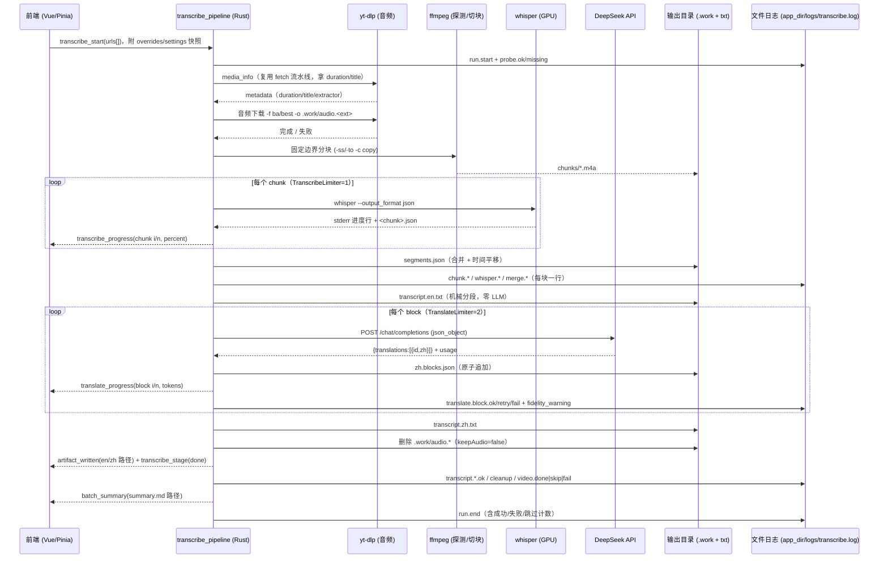

# 批量转录 + AI 翻译中文 Design

## Problem

应用当前只把 URL 变成媒体文件（`docs/current/domains/media-queue/flow.md`、`docs/current/domains/download-engine/flow.md`）。
开发者需要的是「一批 YouTube 链接 → 每个视频两份 txt（英文原稿 + 中文译稿）」，且：

- 译稿必须**语义不得增删**（允许口误微调），原稿必须**保持原文**；
- 转录必须走本机 whisper + GPU（本机实测：`whisper` 20250625 + torch 2.11+cu128，RTX 5050 8GB 可用，仅缓存 `tiny.en`）；
- 媒体只取最低成本形态（`bestaudio`），转录后删除；
- 应用**直接改造**为转录工具（Q15：覆盖，不再保留下载用途）。

本机与代码库现状的差距：无 LLM/翻译集成、无 whisper 集成、无批次产物管理；`Config` 的下载类字段与 UI 全部面向文件下载。

## Goals

- G1：一次输入多条链接（含粘贴、拖放、`.txt`/`.csv` 导入），逐条产出 `transcript.en.txt` + `transcript.zh.txt`。
- G2：原稿 = whisper 逐字文本（仅机械分段，**零 LLM 改写**）；译稿 = 段落 1:1 对齐、允许去口误/填充词、禁止增删与解释。
- G3：默认 `bestaudio` 下载 + GPU 转录 + `small` 模型；模型/设备/语言/分块长度可配置，可切 `medium`。
- G4：长视频与大批量可续跑：分块转录、块级翻译、产物落盘、存在即跳过、失败保留现场。
- G5：密钥与隐私：DeepSeek key 只存 stronghold（新键 `ai.apiKey`），日志/事件不出现明文，发送字幕文本前在 UI 明示。
- G6：覆盖下载用途：移除下载类 UI、配置与参数构造，使代码库只剩一条真实主线。
- G7（追加需求 2026-09-17）：**长链路必须有可即时排查的 `.log` 文件** —— 一个全局轮转日志持续记录关键事件与错误，每行含可检索的关联字段（`run`/`group`/`stage`/event code），带脱敏与体积上限；不得依赖前端订阅内存日志。

## Non-Goals

- 说话人分离、词级时间戳、`.srt`/`.vtt` 作为交付物（`.srt` 仅中间产物）。
- 手动改稿后重译、译文自动评分、回译校验。
- 本地 LLM 运行时（Ollama/LM Studio）、`faster-whisper`/`whisperX`（需新增依赖，另行确认）。
- 保留或恢复原有下载功能（清晰度/编码/容器/字幕/SponsorBlock/输入过滤/部分下载）。
- 中文之外的目标语言产品化（目标语言字段保留，UI 只提供 `zh-Hans`）。

## Must-Not-Break Existing Behavior

- **M1 认证仍生效**：Cookie（`auth.cookieFile`/`auth.cookieBrowser`）与 stronghold 的 5 个键（`auth.username`/`auth.password`/`video.password`/`auth.bearer`/`auth.headers`）继续注入 yt-dlp，受限视频仍可获取音频。
- **M2 网络设置仍生效**：`network.proxy`/`impersonate`/`extractorArgs` 继续作用于 yt-dlp（`with_network_args`）。
- **M3 持久化语义不变**：`config_set` 深合并、`config_reset`、偏好与窗口几何、未知键忽略；**旧配置文件必须能加载**（被删除的字段被忽略，新字段取默认值），不得导致启动失败。
- **M4 工具链不变**：yt-dlp/ffmpeg 仍由签名清单安装到 `bin_dir` 并前置到 `PATH`（`docs/current/domains/toolchain/*`）；ffmpeg 变为转录分块的必需依赖。
- **M5 密钥不外泄**：`RunLogSummary` 的"只记布尔/计数"语义扩展到 DeepSeek key 与请求头。
- **M6 外壳行为不回归**：托盘/菜单/全局快捷键/关闭行为/通知策略/i18n（前后端两份 locale）/应用自更新保持现状。
- **M7 日志能力是新增而非替换**：现有内存分组日志（`LogStore` + `logging_append`，仅订阅时推送、`group_cancel` 时清理）与 Sentry 上报策略不变；文件日志是两个之外的新增通道，且**不得**引入任何新的外传（不上传 Sentry/远端）。

## Current Behavior

- 队列以 `Group`/`MediaItem` 为单位，状态机 10 态（`src/stores/media/state.ts`），卡片按 `stepMap` 渲染步骤组件（`src/components/media-card/MediaCard.vue`）。
- 后端两条流水线（`scheduling/fetch_pipeline.rs`、`scheduling/download_pipeline.rs`）共用一个 `GenericDispatcher`，并发由 `DynamicSemaphore`（`DownloadLimiter`/`FetchLimiter`）控制。
- yt-dlp 参数矩阵覆盖 format/output/location/network/auth/subtitle/sponsorblock/input-filters（`docs/current/domains/download-engine/api-contract.md`）。
- 配置 schema 含 `output.video|audio`、`subtitles`、`sponsorBlock`、`inputFilters` 等下载向字段（`docs/current/domains/settings-preferences/data-model.md`）。
- 无 whisper、无 LLM、无批次产物与续跑机制。

## Proposed Behavior

### 1. 新领域与流水线

新增领域 `transcribe-translate`，每条视频（group）作为一条任务走四个阶段：

```
fetching → downloadingAudio → transcribing → translating → writing → done
                                                             ↘ done（已存在/无语音，汇总标记跳过）
                                                             ↘ error
```

阶段内并发由三个限流器约束：`DownloadLimiter`（复用，默认 2）、`TranscribeLimiter`（新，固定 1，GPU 串行）、
`TranslateLimiter`（新，默认 2）。视频级并发默认 2：允许 A 翻译时 B 转录。

### 2. 音频获取（复用现有能力）

- 只下音频：`-f ba/best`，输出到 `<outputRoot>/<safeTitle>/.work/audio.%(ext)s`。
- 不再需要文件名模板/后处理/字幕/SponsorBlock/过滤参数：`build_audio_download_args()` 只产出
  `-f ba/best`、`-o <path>`、`--no-playlist|--yes-playlist`、网络与认证参数。
- 播放列表链接：自动展开全部条目（复用 `media_playlist_expand` 与 `skipPlaylistSelection`），**不做选择 UI**。

### 3. 分块转录（GPU）

1. 取时长：优先 yt-dlp 元数据 `duration`，缺失时 `ffprobe -show_entries format=duration`。
2. 计算目标边界：`k * chunkMinutes`（默认 20；`0` 表示不分块）。
3. 固定边界切块（评审裁剪 C1：不做静音对齐）：`ffmpeg -ss <start> -to <end> -c copy`（音频帧级精度，不重编码）。
4. 逐块转录：`whisper --model <m> --device cuda --fp16 True --language en --task transcribe --output_format json --verbose True --condition_on_previous_text False --output_dir <chunkDir> <chunk>`。
   进度来自 **stdout 的段行**（2026-09-17 实测格式：`[00:00.000 --> 00:02.160]  text`），stderr 的 tqdm 进度仅用于模型下载提示；块完成以 `<chunk>.json` 落盘为准（权威进度）。
5. 合并：按 `offset = chunk.start` 平移 segment 时间轴，排序后写 `.work/segments.json`（时间单调不减、无重复 id）。
   若某块缺失或覆盖 < 音频时长 − 2s → `chunkCoverageGap`（warning）；若边界处疑似切词（前块末段 `end` 距边界 <0.3s，或后块首段 `start` ≤0.02s）→ `chunkBoundaryRisk`（warning）；两种情况都保留现场供重跑。

### 4. 原稿生成（零 LLM）

`format_english_transcript(segments)`：把 segment 机械合并为段落，规则（按顺序判定）：

- 相邻段间隔 > 1.2s → 断段；
- 当前段落累计 ≥ 700 字符 → 断段；
- 段落内已含 ≥ 3 个句末标点 且 当前段末尾为句末标点 → 断段。

段落之间空一行，段落内按空格拼接（whisper 文本自带标点），**不做任何词级修改**。写 `transcript.en.txt`（`.tmp` → rename 原子落盘）。

### 5. 翻译（DeepSeek）

- 分块：段落 → block（默认 ≤6 段且 ≤3000 字符）；每个请求携带：系统提示（角色 + 硬规则）、术语表、前 2 段的英文原文与已产出译文（上下文，不要求回显）、当前 block 的 `id → text` 列表。
  术语表为**纯文本**（每行 `原文=译文`，评审裁剪 C6）；目标语言固定 `zh-Hans`（裁剪 C5）。
- 硬规则（写入 prompt）：语义不得增删；不解释不总结不加标题；去掉口头填充词（um/uh/you know 等）与明显口误；数字/日期/URL/代码原样保留；术语按术语表；输出严格 JSON。
- 请求：`POST {baseUrl}/chat/completions`，`model=deepseek-chat`，`temperature=0.3`，`response_format={"type":"json_object"}`，
  `messages=[system, user]`，超时 120s；响应解析 `choices[0].message.content` → JSON `{ "translations": [{"id": 12, "zh": "..."}] }`。
- 校验（不通过则重试，最多 `maxRetries`）：id 集合与顺序与请求一致、`zh` 非空、无多余字段说明文本；
  另做**数字保真检查**（原文数字序列必须出现在译文或术语表映射中，缺失仅记 `translationFidelityWarning`）。
- 落盘：每个 block 成功后写 `.work/zh.blocks.json`（`{blockIndex: {ids, zh[], usage}}`，原子写）；
  全部 block 完成后按段落顺序拼 `transcript.zh.txt`。

### 6. 清理、跳过与汇总

- 产物存在性决定跳过：两份 txt 存在且 `overwrite=false` → 该条标记为「已存在跳过」（状态仍为 `done`，汇总中标注 `skipped`，评审裁剪 C7）；`segments.json` 完整 → 跳过转录；`zh.blocks.json` 完整 → 跳过翻译。
- 两份 txt 写成功后删除 `.work/audio.*`（`transcription.keepAudio=true` 时保留）；失败时保留全部现场。
- 批次结束写 `<outputRoot>/summary.md`：每条链接的状态、输出路径、失败码、是否跳过、token 用量合计。

### 7. UI（覆盖式改造）

| 视图 | 内容 |
| --- | --- |
| `/setup`（新） | 环境检查：whisper 路径/版本、CUDA 可用性、目标模型是否已缓存（含文件大小；首次转录自动下载并在转录页展示 stderr 下载进度写入日志）、ffmpeg/ffprobe、DeepSeek key 是否存在；必需项缺失则首页输入禁用（评审裁剪 C2/C3） |
| 首页（改造） | 批次输入（粘贴/拖放/导入）+ 卡片（新步骤：下载音频 / 转录 / 翻译 / 完成）+ 批次汇总入口 |
| 设置（改造） | 转录（模型/设备/语言/分块/keepAudio）、翻译（key/model/baseUrl/温度/术语表 textarea/并发）、输出（根目录/覆盖/目录名限制）、网络、系统、关于 |
| 详情页（改造） | 英文原稿 / 中文译稿 / 日志 三个 tab + 打开输出目录 / 用系统程序打开 txt（评审裁剪 C4：不做内嵌预览） |
| 移除 | 清晰度/编码/音轨/容器/后处理/字幕/SponsorBlock/输入过滤/部分下载的全部 UI 与 `configure` 步骤（入队即自动开始） |

### 8. 长链路日志文件（开发者追加需求，2026-09-17）

目标：整条链路（探测→下载音频→分块→转录→合并→翻译→写盘→清理）很长，出错时必须能**立刻**从文件查到“哪一步、哪条视频、什么错”。

| 维度 | 决定 |
| --- | --- |
| 文件 | **一个全局轮转日志**：`<app_dir>/logs/transcribe.log`，轮转为 `.1`…`.4`（单文件 5MB，总量 ≤ 25MB）；不另建每视频日志，单链路靠 `group` 字段检索 |
| 实现 | `tracing` 注册**文件层**（`tracing-appender` 的滚动 non-blocking writer），与现有 fmt/Sentry 层共存：所有 `tracing::*` 调用自动落盘（含 yt-dlp 运行摘要、工具链安装、配置副作用），无需逐处改动 |
| 格式 | 单行、追加、每行 flush：`<ISO8601 本地时间> \| <LEVEL> \| <event> \| run=<id> group=<id> stage=<stage> <k=v …>`；标题等外部字符串需折叠换行/控制字符并截断（≤80 字符） |
| 事件码 | 稳定、可 grep（下表） |
| 危险操作 | 仅存在性布尔（沿用 `RunLogSummary`）；不记 Cookie/密码/Bearer/请求头/`ai.apiKey`；失败响应片段只记截断内容（≤500 字符） |
| URL 记录范围 | **记录完整 URL（含 query）**（开发者 2026-09-17 决定 A）；日志仅存本机不上传，文档与 UI 提示“外发前先检查” |
| 详细模式 | `logging.verbose`（默认 `false`）：开启后额外把 yt-dlp/whisper/ffmpeg 的逐行原始输出写入文件（内存 `LogStore` 行为不变） |
| 降级 | 日志目录不可写/轮转失败：仅告警一次（`logWriteFailed`）+ 通知，**不阻断**流水线，也不重试频繁 |
| UI 可达 | `transcription_probe` 返回 `logDir`/`logFile`/`logSizeBytes`；设置→关于 显示路径与大小 + “打开日志”；媒体详情页 Logs tab 增加“打开日志文件”（opener 插件，无新 IPC） |
| 隐私 | 日志只存本机；不随 Sentry/其他上报外传（Q17） |

事件码表（实现时必须逐字使用，便于 `grep` 与回归断言）：

| event | level | 必带字段 | 触发点 |
| --- | --- | --- | --- |
| `run.start` / `run.end` | INFO | run, count | 批次开始/结束（含成功/失败/跳过计数） |
| `probe.ok` / `probe.missing` | INFO / ERROR | whisper, cuda, model | 环境探测（启动与手动重检） |
| `stage.change` | INFO | run, group, stage | 四阶段切换 |
| `playlist.expand` | INFO | run, group, entries | 播放列表链接展开为逐视频任务（§2） |
| `audio.download.start` / `.ok` / `.fail` | INFO / INFO / ERROR | group, url, path / exit, errCode | 音频获取 |
| `duration.resolved` / `duration.unknown` | INFO / ERROR | group, duration / — | 时长获取（元数据或 ffprobe） |
| `chunk.plan` / `chunk.cut.ok` / `chunk.cut.fail` | INFO / INFO / ERROR | group, chunks, minutes / idx, start, end / idx, exit | 分块 |
| `whisper.start` / `.ok` / `.fail` / `.oom` | INFO / INFO / ERROR | group, idx, total, model, device / idx, segs, secs / idx, exit, tail / idx | 逐块转录 |
| `merge.ok` / `merge.coverage_gap` / `merge.boundary_risk` | INFO / WARN | group, segs, covered / idx, gap / idx | 合并 |
| `transcript.en.ok` | INFO | group, path, chars, paragraphs | 原稿写出 |
| `translate.block.start` / `.ok` / `.retry` / `.fail` | INFO / INFO / WARN / ERROR | group, block, blocks, chars / prompt, completion / attempt, status / block, status, reason | 翻译块 |
| `translate.fidelity_warning` | WARN | group, block, missing | 数字保真告警 |
| `transcript.zh.ok` | INFO | group, path, chars | 译稿写出 |
| `cleanup.ok` / `cleanup.skip` | INFO | group, removed / reason | 清理 |
| `video.done` / `video.skip` / `video.fail` | INFO / INFO / ERROR | group, outputs / reason / errCode, stage | 单条终态 |
| `cancel.requested` | WARN | group, stage | 取消 |
| `log.write_failed` | WARN | dir, error（仅一次） | 日志降级 |
| `tool.output` | INFO | tool, line | `logging.verbose=true` 时 yt-dlp/whisper/ffmpeg 的逐行原始输出（仅文件日志；Sentry 层按 target 过滤） |

## Alternatives Considered

| 方案 | 结论 | 理由 | 是否升级为 ADR |
|---|---|---|---|
| 调 `whisper` CLI 子进程 | **采用** | 复用现有进程/日志/取消/限流模式，不新增 Python 依赖 | n/a |
| Python helper 脚本包装 whisper | 否决 | 引入第二套运行时与打包问题，收益仅是更易解析进度 | n/a |
| `faster-whisper`（CTranslate2）/ `whisperX` | 第一期否决 | 需装新依赖（ctranslate2 在 Python 3.14 兼容性未知）；先测吞吐再评估 | 建议第二期做 ADR |
| 进程内 `transformers`/`torch` pipeline | 否决 | 常驻显存与依赖体积大，CLI 已可用 | n/a |
| `whisper --task translate` 直接出中文 | 否决 | 该任务只输出英文，无法满足中文译稿 | n/a |
| 本地 LLM（Ollama/LM Studio） | 第一期否决 | 本机未安装；配置保留 `baseUrl`，装好后无需改代码 | n/a |
| 前端直接调 DeepSeek | 否决 | key 泄漏、无 CORS 保障、无法使用 stronghold | n/a |
| 整篇一次性送 LLM 翻译 | 否决 | 超上下文、术语漂移、失败无法局部重试、成本不可控 | n/a |
| 视频级任务 + 阶段内限流 | **采用** | 复用 `GenericDispatcher`；阶段级限流器保证 GPU 串行；实现量最小 | n/a |
| 阶段级独立队列 | 否决 | 吞吐略好但需重写调度与状态模型 | n/a |
| 静音对齐切分 | 否决（一期） | 评审裁剪 C1：需多一次全量 ffmpeg 扫描与解析，收益仅是减少边界切词；改为固定切分 + 边界告警 | n/a |
| 固定切分 + `chunkBoundaryRisk` 告警 | **采用** | 实现量最小；边界风险可观测且保留现场供重跑 | n/a |
| `translation_probe` 预检（`GET /models`） | 否决 | 评审裁剪 C3：首次真实请求的 401 已能给出确定性错误码 | n/a |
| `transcription_download_model` 主动下载模型 | 否决 | 评审裁剪 C2：whisper 首次使用会自动下载（实测：stderr tqdm，且会校验 SHA256，不匹配会重下） | n/a |
| `artifacts_read` + 内嵌文稿预览 | 否决 | 评审裁剪 C4：opener 插件已有 `open_path`/打开目录能力 | n/a |
| `targetLanguage` / 中英文件名可配 | 否决 | 评审裁剪 C5：只有一个取值，徒增配置面与文档 | n/a |
| 结构化术语表（数组 + 校验 UI） | 否决 | 评审裁剪 C6：textarea 纯文本 `原文=译文` 已够用 | n/a |
| `skipped` 独立状态 | 否决 | 评审裁剪 C7：`done` + 汇总标记已能表达“已存在跳过” | n/a |
| 文件日志：`tracing-appender` 文件层 | **采用** | 复用现有 tracing 栈（fmt + Sentry 两层之上再加一层），**现有全部 `tracing::*` 自动落盘**；仅 +1 个官方生态小依赖；无新 capability | n/a |
| 文件日志：`tauri-plugin-log` | 否决 | 需新增插件 + capability + 前端 API，与现有 tracing/Sentry 栈双轨，能力重叠 | n/a |
| 文件日志：自研 `FileLog` + 手写调用点 | 否决 | 需逐处改代码，覆盖不全（工具链/配置等模块的既有日志会漏记） | n/a |
| 每视频独立日志文件 | 否决 | 与“一个 `.log`”诉求不符，且引入 `.work` 删除语义；`group` 字段已能还原单链路 | n/a |
| 保留下载功能为可选模式 | 否决 | 开发者明确要求覆盖 | n/a |

## Business Flow

1. 用户在 `/setup` 完成一次环境检查（whisper/CUDA/模型/ffmpeg/DeepSeek key）。
2. 用户粘贴/导入多条链接 → 卡片立即出现，自动开始；不再需要选择清晰度。
3. 应用逐条下载音频（可并发 2），随后在 GPU 上串行转录（块级进度）。
4. 转录完成后按段落分块翻译（并发 2），块级进度与 token 用量可见。
5. 每条完成后卡片显示两份 txt 路径，可打开输出目录或预览文稿；音频被删除。
6. 全部结束：通知 + `summary.md`；失败项保留 `.work/` 便于续跑。

## End-to-End Data Interaction Flow



| 关键节点 | 输入 | 节点职责 | 输出 / 状态变化 | 关键边界 |
|---|---|---|---|---|
| `transcribe_start`（新命令） | `urls[]`、settings 快照 | 为每条链接建 group 并入队 `TranscribeDispatcher` | 返回 groupId 列表 | 权限/校验：URL 合法性由前端保证；环境未通过（whisper 缺失）直接 `Err` |
| fetch 阶段（复用） | url + overrides | 抓取 title/duration | `media_add` | 失败 → `media_fatal`，该条 `error` |
| 音频下载 | groupId + auth/network | `-f ba/best` 落 `.work/audio.*` | 文件存在 | 取消 → 杀进程树（复用 `group_state`） |
| `chunk_audio` | audio path + `chunkMinutes` | 固定边界切块（裁剪 C1） | `chunks/*.m4a` + `chunks.json` | 单个 ffmpeg 失败即该条 `error`；`chunkMinutes=0` → 单块 |
| whisper runner | chunk path + model/device | 执行；stdout 段行→进度，json 落盘→块完成 | `<chunk>.json` | GPU OOM/退出码非 0 → `whisperOutOfMemory`/`whisperFailed`；取消则杀进程 |
| `merge_segments` | 各 chunk json + offsets | 平移、排序、去重、覆盖/边界检查 | `segments.json` | 覆盖不足 → `chunkCoverageGap`；疑似切词 → `chunkBoundaryRisk`（均为 warning，不阻断） |
| `format_english_transcript` | segments | 机械分段 | `transcript.en.txt`（原子写） | 纯函数，无网络调用（G2 的护栏） |
| `deepseek_client` | block + 术语表 + 上下文 | HTTP + 重试 + 用量统计 | JSON 响应 | 401 立即失败；429/5xx/超时按 `maxRetries` 退避；key 只从 stronghold 读 |
| `validate_translation` | 请求 id 集 + 响应 | 契约校验 + 数字保真 | pass / `translationContractViolation` | 校验失败禁止落盘 |
| block 持久化 | 单块结果 | 原子写 `zh.blocks.json` | 可续跑 | 只有全部 block 完成才拼 `transcript.zh.txt` |
| 清理 | 两份 txt 状态 | 删音频/保留现场 | `.work` 状态 | 仅在双 txt 成功后删除；`keepAudio` 例外 |
| 文件日志层 | 所有 `tracing` 事件 + 流水线事件码 | 单行追加、逐行 flush、5MB × 5 轮转、集中脱敏 | `app_dir/logs/transcribe.log`(+`.1`…`.4`) | **旁路**：写入失败仅告警（`log.write_failed`）不得阻断；不参与状态机；不外传 Sentry |

## Data And API Impact

### 配置 schema（`Config`，`config.store.json`）

新增：

```text
transcription: {
  model: "small" | "medium" | "large-v3",      // 默认 small
  device: "cuda" | "cpu",                      // 默认 cuda
  fp16: bool,                                  // 默认 true（device=cuda 时生效）
  language: "en" | "auto",                     // 默认 en
  chunkMinutes: u32,                           // 默认 20；0 = 不分块
  keepAudio: bool,                             // 默认 false
  whisperPath: Option<String>,                 // 探测结果可手工覆盖
  conditionOnPreviousText: bool                // 默认 false（降低幻觉循环）
}
translation: {
  baseUrl: String,                             // 默认 https://api.deepseek.com
  model: String,                               // 默认 deepseek-chat
  temperature: f32,                            // 默认 0.3
  concurrency: usize,                          // 默认 2
  maxRetries: u32,                             // 默认 2
  maxSegmentsPerBlock: u32,                    // 默认 6
  maxCharsPerBlock: u32,                       // 默认 3000
  glossary: String,                            // 默认 ""；每行 `原文=译文`（裁剪 C6）
  dropFillers: bool                            // 默认 true（仅影响译稿）
}
output: {
  rootDir: Option<String>,                     // 默认 <系统下载目录>/ovd-transcripts（before_initialized 填）
  overwrite: bool,                             // 默认 false
  restrictFilenames: bool                      // 默认 false（仅影响目录名）
}
```

固定常量（不做配置项，裁剪 C5/C7）：目标语言 `zh-Hans`；交付文件名固定 `transcript.en.txt` / `transcript.zh.txt`；中间产物在 `<输出目录>/<标题>/.work/`；"已存在跳过"不引入独立状态，用 `done` + 汇总标记表达。

新增（追加需求 2026-09-17）：

```text
logging: {
  verbose: bool                                // 默认 false；true 时把 yt-dlp/whisper/ffmpeg 逐行原始输出也写文件
}
```

日志路径与轮转**不做配置项**：固定 `<app_dir>/logs/transcribe.log`（`app_dir` 见 `docs/current/platform/storage.md`），单文件 5MB、保留 5 个；`tracing-appender`（新增依赖，仅 Rust 侧）。

移除：`output.video|audio|addMetadata|addThumbnail|saveThumbnail|preciseCuts|reversePlaylistNumbering|downloadDir|fileNameTemplate|audioFileNameTemplate`、
`subtitles`、`sponsorBlock`、`inputFilters`、`input.preferVideoInMixedLinks`、`performance.autoLoadSize`、`performance.splitPlaylistThreshold`（播放列表不再拆分/合并）。
保留：`appearance`、`auth`、`network`、`input`（`autoFillClipboard`/`globalShortcuts`）、`performance.maxConcurrency`（下载并发）、`update`、`system`、`notifications`。

**兼容性**：`JsonBackedState::materialize` 的"默认值 + 深合并"保证旧文件可加载（被删字段忽略）；不做迁移代码，回滚 = 回退版本，用户的旧字段仍在文件里（无破坏）。

### Stronghold

新增键 `ai.apiKey`（DeepSeek key）。已有 5 个 auth 键名与语义不变（不得重命名）。

### IPC

| 类型 | 名称 | 说明 |
| --- | --- | --- |
| 命令（新） | `transcription_probe` | 返回 whisper 路径/版本、CUDA 可用、模型是否缓存及大小、ffmpeg/ffprobe 路径、DeepSeek key 是否已配置（不验证连通性，裁剪 C3）、**日志路径与大小（`logDir`/`logFile`/`logSizeBytes`）** |
| 命令（新） | `transcribe_start` | 入队一批 URL（`urls: string[]`），返回 `groupId[]` |
| 命令（复用） | `group_cancel` | 取消该视频（杀 yt-dlp/ffmpeg/whisper 进程，丢弃在途翻译） |
| 命令（移除） | `media_size` | 体积查询不再需要 |
| 事件（新） | `transcribe_stage` | `{id, groupId, stage}`，stage ∈ `downloadingAudio\|transcribing\|translating\|writing` |
| 事件（新） | `transcribe_progress` | `{id, groupId, chunkIndex, chunkTotal, percent}` |
| 事件（新） | `translate_progress` | `{id, groupId, blockIndex, blockTotal, promptTokens, completionTokens}` |
| 事件（新） | `artifact_written` | `{id, groupId, kind: "en"\|"zh", path}` |
| 事件（新） | `batch_summary` | `{path, items: [{groupId, url, status, errorCode?, outputs?}]}` |
| 事件（移除） | `media_size` | 随命令一起移除 |

## Frontend Fetching Logic

- 环境检查：`/setup` 挂载时调用 `transcription_probe`（一次调用同时汇报 whisper/CUDA/模型缓存/ffmpeg/ffprobe/key 状态）；不轮询，用户可点"重新检测"。
- 元数据/阶段/进度：全部事件驱动（`media_add`、`transcribe_stage`、`transcribe_progress`、`translate_progress`、`artifact_written`、`batch_summary`），监听注册沿用 `src/tauri/listeners/*` + `plugins/tauriListeners.ts`。
- 文稿查看：详情页只展示路径与"打开输出目录"、"用系统程序打开 txt"（复用 opener 插件 `open_path`/`opener:allow-open-path **/*`）；不做内嵌文本读取（裁剪 C4）。
- 设置：`config_get` 一次加载，保存走 `config_set`（整份草稿，沿用 `SettingsView` 机制）。
- 术语表：`translation.glossary` 为纯文本（textarea），随 `config.store.json` 持久化；不需要单独 IPC。
- 日志查看：路径/大小来自 `transcription_probe`；用 opener 插件打开文件或目录；前端**不读取**日志内容（不做第二个预览实现，与裁剪 C4 一致）。
- 跳过与已存在的判定由后端返回（`artifact_written` 路径 + 汇总标记），前端不自行读磁盘。

## Frontend Behavior

- 新 store `transcription`：`probe` 结果、模型缓存状态、批次汇总、token 用量；不持久化。
- `MediaState` 新增：`downloadingAudio`、`transcribing`、`translating`、`writing`，并删除 `configure`；"已存在跳过"不新增状态，用 `done` + 汇总标记表达（裁剪 C7）。
- 卡片步骤组件：`FetchStep`（复用）、`AudioDownloadStep`、`TranscribeStep`（块进度 + 当前模型）、`TranslateStep`（块进度 + token）、`DoneStep`（两份 txt 路径 + 打开目录/文件 + 跳过标记）、`ErrorStep`（错误码本地化 + 重试）；不新增 `SkippedStep`。
- 输入：保留顶栏 URL 输入、拖放、`.txt`/`.csv` 导入、剪贴板监听与全局快捷键；入队后自动开始（无 configure、无下载按钮）。
- 设置页签改为：转录 / 翻译 / 输出 / 网络 / 系统 / 关于；删除质量与字幕页签、`SettingsSponsorBlock`、`SettingsPerformance` 中的下载向字段（保留并发与通知）。
- 删除视图：`SubtitleView`、`InputFiltersView`、`MediaPreferencesView` 及其子组件；删除对应 helpers（`formats`、`resolutionSelection`、`partialDownload`、`inputFilters`、`subtitles/*`、`playlistSelection` 中仅供选择 UI 的部分）。
- i18n：新增 `transcription.*`、`translation.*`、`setup.*`、`errors.transcribe.*` 键（前后端两份 locale 同步，`ko` 缺口不扩大）。
- 通知：批次完成/失败沿用 `notify` 命令（新增 kind `batchFinished`）。
- 日志入口：设置→关于 展示日志路径与大小 + “打开日志”；媒体详情页 Logs tab（现有内存流）增加“打开日志文件”；i18n 新增 `logs.*` 键（两份 locale）。

## Backend Fetching Logic

| 读路径 | 数据源 | 拥有者 | 事务/缓存/批量策略 | 失败与降级 | 一致性 |
| --- | --- | --- | --- | --- | --- |
| 元数据（title/duration） | yt-dlp `-J --flat-playlist`（复用 fetch 流水线） | `scheduling::fetch_pipeline` | 每条一次；结果通过 `media_add` 事件交前端 | 非 0 退出 → `media_fatal`；`duration` 为空 → 走 ffprobe | 前端展示与后端一致（同一 payload） |
| 时长兜底 | `ffprobe -v error -show_entries format=duration -of json` | 新 `runners::ffmpeg_runner` | 每视频一次，结果写 `.work/probe.json` | 解析失败 → `durationUnknown`（该条 `error`） | 分块边界严格基于该值 |
| 分块转录结果 | `<chunk>.json`（whisper `--output_format json`，实测文件名 `<basename>.json`，顶层 `text/segments/language`，段字段 `start/end/text`） | 新 `transcribe::chunking` | 逐块读取，块完成即用；不重读 | JSON 缺 `segments` → `whisperFailed` | 只有全块成功才写 `segments.json` |
| 段落/块产物 | `.work/segments.json`、`.work/zh.blocks.json` | 新 `transcribe::artifacts` | 原子写（`.tmp` → rename）；存在性与完整性决定跳过 | 文件损坏 → 视为缺失并重算 | 双 txt 只从完整产物生成 |
| 翻译响应 | DeepSeek `POST /chat/completions` | 新 `translation::deepseek_client` | 每 block 一次请求；最多 `maxRetries` 次退避重试 | 401 → 该条 `error` 并提示 key；429/5xx/超时 → 重试后失败 | 校验通过才落盘，避免半截译文 |
| 密钥 | stronghold `ai.apiKey` | `stronghold::StrongholdState` | 每次请求前读一次（不缓存明文） | 保险库锁定/无 key → `deepseekAuthFailed` | 只出现在 `Authorization` 头，不落日志 |
| 环境探测 | `whisper` 可执行文件/`--help`、`ffmpeg -version`、`ffprobe -version`、模型缓存文件大小、stronghold 是否已有 `ai.apiKey` | 新 `commands::transcription` | 手动触发，不缓存 | 探测失败 → `/setup` 展示原文错误 | 探测结果只驱动 UI 与门禁，不写配置 |
| 文件日志 | 运行时自身产生（非读盘）：`tracing` 文件层写入；UI 只需路径与大小 | 新 `logging` 文件层 | 追加 + 每行 flush；5MB × 5 轮转；`verbose` 控制是否含工具逐行输出 | 目录不可写 → `log.write_failed`（仅一次）+ 继续运行 | 只是旁路记录：日志写入失败不得影响产物与状态 |

## Backend Behavior

| 模块 | 职责 | 关键约束 |
| --- | --- | --- |
| `runners/whisper_runner.rs` | argv 构造、spawn、**stdout 段行**进度解析、stderr 日志透传、退出码/错误映射 | argv 白名单式构造；**必须复用 `runners/ytdlp_process.rs` 的进程封装**（隐藏窗口、进程组/Job Object、取消杀树，W001）；子进程 `PATH` 前置 `bin_dir`（whisper 需要找到 ffmpeg）；OOM 识别 `CUDA out of memory` |
| `runners/ffmpeg_runner.rs` | `ffprobe` 时长、`-ss/-to -c copy` 切块 | 复用同一进程封装；不使用 `silencedetect`（裁剪 C1） |
| `transcribe/chunking.rs` | 固定边界计算、切块编排、`chunks.json` | `chunkMinutes=0` → 单块；边界误差 ≤0.5s；不做静音对齐 |
| `transcribe/merge.rs` | chunk segments 平移/排序/去重/覆盖检查 | 输出时间单调不减；覆盖缺口只告警 |
| `transcribe/transcript.rs` | 机械分段、txt 写出（原子） | 纯函数；**不引用任何 LLM 模块**（G2 护栏） |
| `translation/blocks.rs` | 段落→block、prompt 组装、纯文本术语表注入、上下文拼接 | prompt 模板集中一处，便于验收与回归；术语表按行解析 `原文=译文` |
| `translation/deepseek_client.rs` | HTTP、JSON 模式、重试/退避、用量累计、密钥读取 | 超时 120s；日志只记 model/block/tokens |
| `translation/validate.rs` | id/顺序/非空/数字保真校验 | 校验失败不落盘 |
| `scheduling/transcribe_pipeline.rs` | 视频级任务编排 + 三限流器 + 阶段事件 | `TranscribeLimiter` 固定 1；取消立即生效 |
| `commands/transcription/*` | 2 个新命令（`transcription_probe`、`transcribe_start`）+ 批次内的 `group_cancel` 复用 | 命令薄层；业务在 pipeline |
| `logging` 文件层（新增，接入 `lib.rs::init_tracing`） | 给现有 `tracing` registry 再挂一个 `tracing-appender` 滚动文件层；定义带 `run`/`group`/`stage` 字段的日志宏/辅助函数与事件码常量 | 单行 + 逐行 flush；5MB × 5 轮转；**不得**重写或绕过现有 fmt/Sentry 层；脱敏常量（敏感字段名黑名单）集中一处 |
| `state/config_models.rs` | 新 schema + 删除下载向字段 | `Default` 与前端 `defaultSettings` 必须一致 |

删除（避免死代码与误导）：`runners/ytdlp_args/format_args.rs`、`output_args.rs`（被 `audio_args.rs` 取代）、
`input_filter_args.rs`、`ytdlp_runner.rs` 中的 subtitle/sponsorblock 构造、`parsers/ytdlp_single/{formats,codecs,tracks}.rs`
中仅供下载选项的聚合（保留 `chapters`? 否 → 删除）、`models/download.rs` 中后处理/字幕/过滤结构、
对应前端 helpers/components，以及 `tests/unit/{formats,resolutionSelection,partialDownload,inputFilters*,playlistSelection*,postprocess*,subtitle*,networkOverrides}.spec.ts`
（按删除范围同步删除测试，不保留"死测试"）。

## Error Handling

| 错误码 | 触发 | 影响 | 用户可见 | 上报 |
| --- | --- | --- | --- | --- |
| `whisperMissing` | 探测不到 whisper 可执行文件 | 全局门禁，禁止入队 | `/setup` 提示安装命令 | 否 |
| `whisperOutOfMemory` | stderr 含 `CUDA out of memory` | 该条 `error`，保留音频 | 建议关闭占显存程序/降低模型 | 是 |
| `whisperFailed` | 退出码非 0 或 JSON 缺失 | 该条 `error` | 显示 stderr 摘要 + 日志页 | 是 |
| `ffmpegMissing` / `ffmpegChunkFailed` | 工具缺失 / 切块失败 | 该条 `error` | 提示工具链安装 | 是（ChunkFailed） |
| `durationUnknown` | 元数据与 ffprobe 都拿不到时长 | 该条 `error` | 提示不支持/损坏音频 | 否 |
| `chunkCoverageGap` | 合并后覆盖不足 | warning，继续 | 汇总里标注 | 是 |
| `chunkBoundaryRisk` | 边界处疑似切词（前块末段距边界 <0.3s 或后块首段 ≤0.02s） | warning，继续 | 汇总里标注 | 否 |
| `noSpeechDetected` | whisper 输出 0 段 | 标记跳过（状态 `done` + 汇总标注） | 标注"无语音" | 否 |
| `deepseekAuthFailed` | 401/无 key | 该条 `error`（整批可能全失败） | 提示到设置页填 key | 否 |
| `deepseekRateLimited` | 429 | 退避重试后仍失败 → `error` | 提示稍后重试 | 否 |
| `deepseekServerError` / `deepseekTimeout` | 5xx / 超时 | 重试后 `error` | 汇总标注 | 是（5xx） |
| `translationContractViolation` | id/顺序/非空校验失败 | 重试后 `error`，不写 zh txt | 汇总标注（含 block 序号） | 是 |
| `translationFidelityWarning` | 数字保真检查未通过 | warning，继续 | 汇总标注 | 否 |
| `outputWriteFailed` | 原子写失败/磁盘满 | 该条 `error` | 提示路径与磁盘 | 是 |
| `logWriteFailed` | 日志目录不可写/轮转失败 | warning，**不阻断**；只告警一次 | toast + 设置页标注日志不可用 | 否 |

取消语义：`group_cancel` 必须杀死当前 yt-dlp/ffmpeg/whisper 进程；在途 DeepSeek 请求允许完成，但落盘前检查取消标志（避免取消后仍写产物）。

## Risks

| 风险 | 影响 | 缓解 |
| --- | --- | --- |
| whisper 输出契约变动（无稳定契约） | 进度丢失或误判 | 2026-09-17 实测：段行在 **stdout**（`[hh:mm:ss.mmm --> ...]  text`）、tqdm 在 stderr、json 顶层 `text/segments/language`；进度仅作展示，块完成以 JSON 文件为权威；探测时记录 whisper 版本 |
| DeepSeek 成本/限流（长视频 token 量大） | 费用与失败率 | 块级续跑、token 用量可见、`maxRetries` 与退避、单批条数上限 |
| 口误微调被模型扩大为改写 | 违反"语义不得增删" | 低温度 + 硬规则 prompt + id/顺序校验 + 数字保真检查 + 人工抽验（L3） |
| 8GB 显存被其它程序占用（实测空闲 1.23GB） | whisper OOM | 默认 `small`、明确 OOM 错误码与提示、失败保留续跑现场 |
| 首次运行需下载 461MB 模型（实测：whisper 每次会校验 SHA256，不匹配会重下） | 首体验差/网络失败 | 首次转录自动下载（stderr tqdm 进度写入日志），失败给出 `whisperFailed` + 重试；不做主动下载命令（裁剪 C2） |
| 固定切分可能切词 | 少量词缺失/错字 | `chunkBoundaryRisk` 告警 + 保留现场；`chunkMinutes` 可调大或设 0 |
| ASR 错误会污染译稿（实测 tiny.en 将 `2024 and 90 percent` 识别为 `arely areful and joshi percent`） | 译稿数字/术语错误，且数字保真校验会告警 | 默认 `small`、可切 `medium`；数字保真告警暴露问题；后续可评估 `--initial_prompt`（本期不做） |
| 覆盖式删除下载功能 | 用户无法回到旧用途 | 开发者已确认；回滚依赖 git（`.work` 与输出目录不受影响） |
| 配置 schema 大改 | 旧配置加载异常 | 深合并 + 未知键忽略；AC 覆盖旧文件加载 |
| CI 无法覆盖 whisper/DeepSeek 真实调用 | 回归靠人工 | L1 全 mock + L3 手工验收清单；不把 L1 当 L2 |
| 日志误记敏感值（Cookie/Key/签名 URL 的 query） | 泄漏到本地文件/被分享排查 | 集中脱敏（敏感字段布尔化）+ 失败响应截断 + 文件仅存本机不上传；URL 按已确认决策记完整值（2026-09-17 决定 A），文档与 UI 提示“外发前先检查”；AC-23 断言其他敏感值不出现 |
| 日志无限增长/写满磁盘 | 磁盘占满导致下载/转录失败 | 5MB × 5 轮转 + `verbose` 默认关；轮转失败只告警不重试；AC-25 断言上限 |
| 新增依赖 `tracing-appender` 的版本/许可证风险 | 构建/合规问题 | 官方 tracing 生态 crate（MIT/Apache-2.0），随 `npm run licenses:rust` 进入许可证清单；CI 构建验证 |
| **YouTube 现行反爬要求**：yt-dlp 2026.07+ 对 YouTube 需 JS runtime + EJS challenge solver（n challenge），否则媒体 GET 403 | 真实下载阶段直接失败，整条链路不可用 | L005 真实媒体干跑实测（2026-09-17，video `nIABz0Z4IRA`，见 implementation-notes §8）：本机无 deno，需 `--js-runtimes node --remote-components ejs:github` 且 `player_client=mweb` 才成功（并回退到 `best`）；`ejs:github` 运行时从 GitHub 取脚本与“远端内容必须签名校验”的规则冲突。**需在 L008/Phase C 前定方案**：① 签名清单分发 JS runtime 与 EJS 求解脚本；② 依赖用户 Cookie；③ 固定可用的 player_client 组合；并同步 toolchain 文档 |
| 日志写入竞争/阻塞主流程 | 转录变慢 | non-blocking writer（独立写线程）+ 写失败静默降级；不在流水线关键路径上做同步 fsync |

## Verification

见 `docs/changes/2026-09-17-batch-transcribe-translate/verification.md`：
L1 覆盖 argv 构造、分块/合并、机械分段、block 组装与校验、配置兼容、错误映射、日志行格式与脱敏；
L2 覆盖 fake 二进制 + mock DeepSeek 的端到端流水线（文件系统真实读写，含日志文件写入/轮转/降级）+ 事件序列；
L3 覆盖真实 whisper GPU 转录（含 stdout 进度契约与 OOM 路径）、真实 DeepSeek 翻译抽样，以及“日志能用于事后定位”的实战验收。

## Design Deviations

| 偏差 | 发现于 | 与设计不符之处 | 处理（改设计 / 改现状文档 / 接受） |
|---|---|---|---|
| 文件日志写入器：同步自研 `SizeRotatingFile` 取代 `tracing-appender` 非阻塞 writer | L003（2026-09-17） | §8 与 Alternatives 选定 `tracing-appender` 滚动 non-blocking writer；但其 `Rotation` 仅支持时间维度（`MINUTELY`/`HOURLY`/`DAILY`/`NEVER`），无法实现 AC-25 要求的“单文件 5MB、保留 5 个”体积上限，size-rotation 必须自研。既然 writer 自研，非阻塞包装只增加一个依赖与 guard 生命周期，而每行一次 `write(2)`（无 fsync）不会明显阻塞流水线 | **接受（开发者 2026-09-17 确认）**：改为 `tracing` fmt 层 + 自研 `SizeRotatingFile`（同步、逐行单次写、5MB×5），不新增依赖。若坚持非阻塞，后续把 writer 包一层 `non_blocking` 即可（约 3 行）；需先由 cargo 刷新 `Cargo.lock` |
| ffmpeg 切块用 `-t <duration>` 而非 `-to <end>` | L004（2026-09-17） | §3 与关键节点表写 `ffmpeg -ss <start> -to <end> -c copy`；输入 `-ss` 与 `-to` 组合时，`-to` 的相对时间轴随 ffmpeg 版本不同（相对 seek 点或文件起点），会切错块长 | 接受：`-ss <start> -i <in> -t <end-start> -c copy <out>`（`-t` 语义无歧义）；块边界仍由 `plan_chunks` 的 `[start, end]` 决定 |
| 跳过判定新增 `.work/source.json`（URL→输出目录标记） | L008（2026-09-17） | §6 说“产物存在性决定跳过”，但输出目录名来自标题（只能通过 yt-dlp 元数据得到），与 AC-14 的“跳过时零网络请求”矛盾：不联网就无法定位已有目录 | 接受：首次解析标题后写入 `<输出目录>/.work/source.json`（url+title）；重跑时先本地扫描 `output.rootDir` 下各目录的标记，命中且两份 txt 存在 → 零网络跳过。`.work` 仍仅为中间产物；同批次标题重名仍可能目录冲突（已记 implementation-notes §10） |
| 播放列表展开落在 pipeline 内（同一 group 的逐视频 item），而非显式调用 `media_playlist_expand` 命令 | L010（2026-09-17） | §2 写“复用 `media_playlist_expand` 与 `skipPlaylistSelection`”；`media_playlist_expand` 是面向“前端已拿到条目并选择范围”的场景，转录流没有选择 UI，且 `transcribe_start` 返回 `groupId[]` 的契约要求每输入链接一个 group | 接受：fetch 阶段解析出 `ParsedMedia::Playlist` 后，在同一 group 内为每个条目生成逐视频任务（同 batch、同 group、`total = entries`），`PlaylistEntry.index` 不参与调度；`skipPlaylistSelection` 仅是前端 group 标志，本流不需要。事件表新增 `playlist.expand`（INFO：run/group/entries） |

## Version History

<!-- 交付后由开发者反馈触发（v2.0…）。实施期偏差写 Design Deviations，不升版本。 -->

## Current Doc Updates

- [ ] 新建 `docs/current/domains/transcribe-translate/`（index/flow/api-contract/data-model/backend-behavior/frontend-behavior/error-handling/verification）
- [ ] `docs/current/product/overview.md`、`glossary.md`、`user-journeys.md`（新增 J9）、`acceptance.md`（新增 A26+）
- [ ] `docs/current/domains/media-queue/*`（去掉 configure/体积/选择步骤，改为自动流水线）
- [ ] `docs/current/domains/download-engine/*`（参数矩阵收缩为音频下载；删除字幕/SponsorBlock/后处理段）
- [ ] `docs/current/domains/settings-preferences/*`（schema 更新 + 旧字段标记 superseded）
- [ ] `docs/current/domains/app-lifecycle/*`（`/setup` 页与启动门禁）
- [ ] `docs/current/platform/build-test-lint.md`（新增 L2/L3 验证入口）、`observability.md`（**新增“文件日志”段**：路径/单行格式/事件码表/轮转/脱敏/`logging.verbose`；新错误码与上报策略）、`storage.md`（`<app_dir>/logs/` 与轮转文件）
- [ ] `docs/current/rules/security.rules.md`（日志脱敏：敏感字段布尔化、失败响应截断、日志不外传）、`docs/current/rules/architecture.rules.md`（日志层不得绕过 fmt/Sentry 层）
- [ ] `docs/README.md`（官网/文档库说明不变，补充新领域入口）、`docs/manifest.yaml`（新路由 `transcribe-translate`，更新 `media-queue`/`download-engine` 的 required 与 `code_globs`）
- [ ] `docs/evals/regression-matrix.md`、`feature-checklist.md` 增补条目
- [ ] 旧文档如需保留历史，移入 `docs/archive/superseded/` 并标 `superseded_by`
