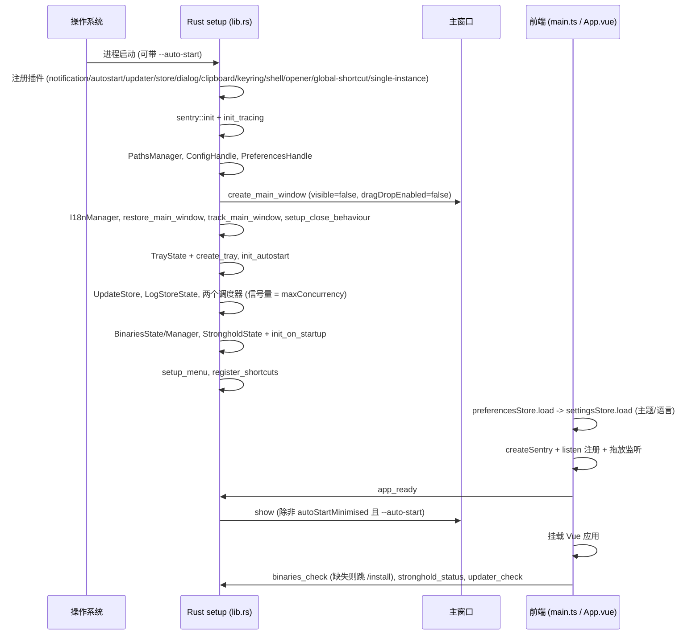
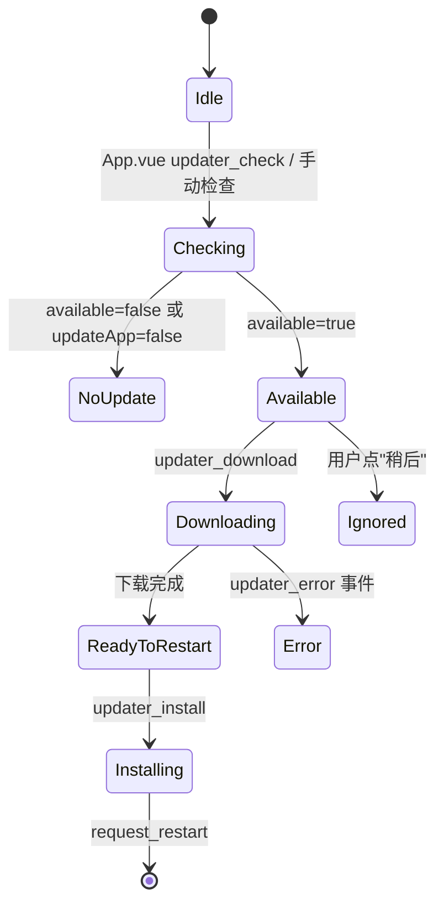

# app-lifecycle 流程

## Purpose

描述从进程启动到退出的完整时序，以及应用自更新的状态机；所有平台差异都在此显式标注。

## Current Behavior

### 启动时序

要点：

- 窗口在配置中 `create: false` + `visible: false`，由 Rust 手动创建；Windows 便携版额外指定 `webview` 数据目录（`app_dir/webview`）。
- `single_instance` 插件：第二次启动不再建窗口，而是 `reopen_window`（show + focus）。
- macOS 的 `RunEvent::Reopen`（点击 Dock 图标）同样走 `reopen_window`。
- 前端 store 加载失败不阻塞挂载（只 `console.error`），因此"设置损坏导致 init 失败"是唯一的启动阻断源（见 settings-preferences）。

### 窗口行为

| 行为 | 实现 |
| --- | --- |
| 尺寸/位置恢复 | `restore_main_window`：读 `preferences.window`；最大化时用 `prevX/prevY`；位置必须落在某个显示器矩形内 |
| 尺寸/位置跟踪 | `track_main_window`：`Moved`/`Resized` → 300ms 防抖 → `preferences_set`；关闭时立即 flush；最大化时不记录 |
| 关闭窗口 | `setup_close_behaviour`：macOS 始终 `prevent_close` + `hide`；其它平台仅当 `system.trayEnabled` 为真时按 `closeBehavior`（`hide`/`exit`）处理 |
| Linux Wayland 兜底 | 获得焦点时切换 `resizable` false→true（tao#1046） |
| 窗口进度/徽标 | 前端 `tauri/window.ts` 调 `setProgressBar`/`setBadgeCount`/`requestUserAttention`（capability 已授权） |

### 托盘与菜单

- 托盘仅在 `system.trayEnabled` 为真时创建；配置变更时 `on_updated` 会重建/销毁。
- 托盘菜单项（i18n key `tray.*`）：`add_to_queue`、`add_and_download`、`download`、`hide_toggle`、`quit`。
  前三项发 `shortcut_action` 事件（与全局快捷键同一条前端链路）；`quit` 直接 `app.exit(0)`。
- Windows 上左键单击托盘图标 → 取消最小化 + show + focus；macOS 上 `show_menu_on_left_click(true)`。
- 应用菜单：macOS 提供 App 菜单（关于/设置 ⌘,/服务/隐藏/退出）与 Edit 菜单；设置项发 `navigate{route:"settings"}`。
  Windows/Linux 为**空菜单**（`items(&[])`），因此无原生菜单入口。

### 全局快捷键

- 注册条件：`input.globalShortcuts == true`（配置变更时即时注册/注销）。
- 组合键：macOS 为 `Ctrl+Shift`，其它平台为 `Alt+Shift`；按键 `V`（仅入队）、`D`（入队并下载）、`Enter`（下载全部）。
- 触发时发 `shortcut_action{action}`；前端读取剪贴板并校验 URL 后调用队列动作，`fromShortcut = true`
  （使通知 `force=true` 必弹）。

### 通知

- 唯一入口是 `notify` 命令（见 `api-contract.md`），由前端在业务事件点调用。
- 判定链：`disabledNotifications` → `notificationBehavior`（`never`/`always`/`onBackground`）→ 窗口可见性（`force` 可跳过）。
- 文案由 Rust `I18nManager` 渲染（`notifications.<kind>.title|body`），语言与界面语言独立同步。
- 平台实现：Linux 用 `notify_rust`，其它平台用 `tauri_plugin_notification`。

### 界面语言（i18n）

- 前端：`vue-i18n`，locale 由 `appearance.language`（`system` 时用浏览器/系统语言）决定；
  切换时同时更新 `<html lang>`。
- 后端：`I18nManager` 内嵌 `src-tauri/locales/*.json`（`include_dir!`），用于托盘、菜单、通知、安装页的 key；
  缺 key 回退英文。
- 两份 locale 文件必须键一致；`src-tauri/tauri.conf.json` 的 NSIS `languages` 列表决定 Windows 安装器语言。

### 主题

- `appearance.theme` 为 `system` 时**不写** `data-theme`，由 CSS 的 `prefers-color-scheme` 决定；否则写 `document.body[data-theme]`。
- `useTheme` 监听系统主题变化并在 `system` 模式下移除属性。

### 应用自更新流程

- 门控：`settings.update.updateApp` 为假时前端不检查。
- 不可更新环境：`is_microsoft_store_app || is_portable_app || is_snap_app` → 直接返回 `available=false`。
- 更新源：`tauri.conf.json` 的 `plugins.updater.endpoints`（GitHub Releases 的 `latest.json`）+ minisign 公钥校验。
- 下载与安装分两步：`updater_download` 把字节缓存在内存（`UpdateStore`），`updater_install` 安装并 `request_restart`。
- 进度通过 `updater_download_progress{received,total}` 推送；失败发 `updater_error{string}`；安装完成发 `updater_finished`。

### 自启动

- `init_autostart`（启动时）+ `on_updated`（配置变更时）双向同步：配置为真而系统未启用 → enable；反之 disable。
- 自启动时携带 `--auto-start`；若 `system.autoStartMinimised` 为真，`app_ready` 不显示窗口。

## Boundaries

- 前端不做系统集成判断（平台差异由 `get_platform` 与后端配置提供）。
- 应用退出时**不**保存队列（见 product/overview 的边界）。
- 更新流程不做差分下载或后台静默安装。

## Contracts

- 命令/事件：`api-contract.md`。
- 设置字段：`../settings-preferences/data-model.md`。
- 平台事实：`../platform/backend-runtime.md`、`../platform/frontend-runtime.md`。

## Failure And Edge Cases

- 托盘创建/销毁失败只记录 warning，不阻断启动（表现为"配置为开但看不到托盘图标"）。
- 快捷键注册冲突（被其它应用占用）时只记录 warning，功能静默失效。
- Windows/Linux 无原生菜单，设置入口只有界面顶栏的齿轮按钮。
- 自启动最小化时用户可能以为"应用没启动"；托盘未开启时只能通过再次启动（单实例会 show 窗口）。
- `updater_install` 失败不回滚已下载字节，用户可重试；`isNeedingRestart` 会在失败后保持为 `false`（前端 `install()` 会先清标志）。
- macOS debug 构建不自动解锁保险库（见 auth-secrets），与更新流程无关。

## Verification

见 `docs/current/domains/app-lifecycle/verification.md`。
