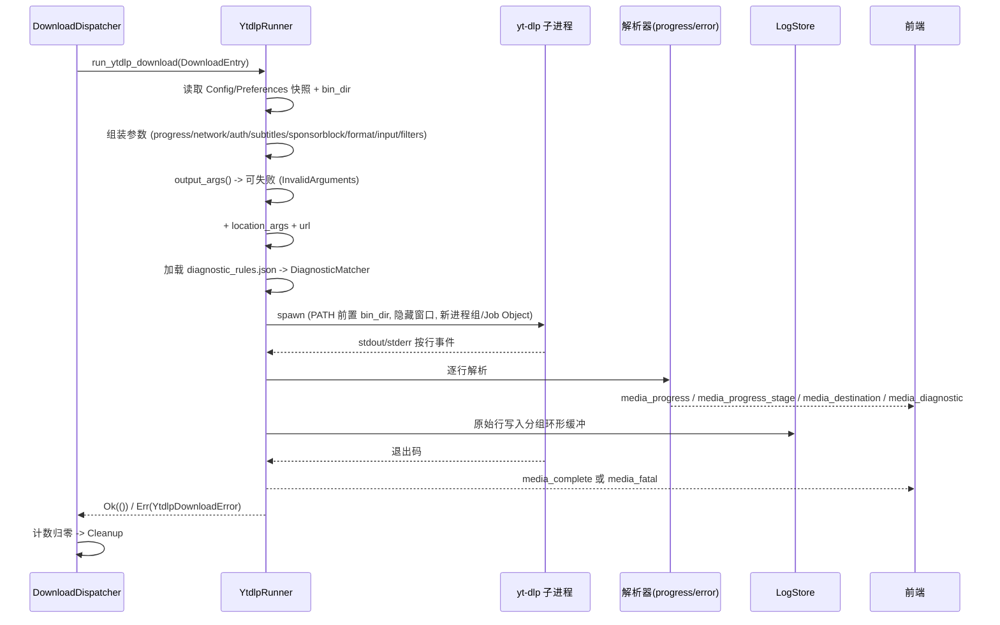

# download-engine 流程

## Purpose

把"一条 `DownloadEntry` 如何变成一个文件、以及过程中的每个可观测信号由谁产生"讲清楚，
作为修改参数构造、解析或取消逻辑时的实现约束。

## Current Behavior

### 端到端流程

### 关键节点

| 节点 | 输入 | 职责 | 输出/状态变化 | 边界 |
| --- | --- | --- | --- | --- |
| `run_ytdlp_download` | `DownloadEntry` | 组装参数、创建解析器、驱动事件循环 | 事件 + `Result` | 只处理单条 item |
| `YtdlpRunner::new` | `AppHandle` | 取 `PathsManager.bin_dir`、快照 `Config`/`Preferences` | 不可变 runner | 快照在本次运行内不变（设置中途变更不影响已启动任务） |
| 参数构造链 | runner + overrides | `resolve_with_patch` 合并全局与 override | 完整 argv | `output_args()` 可返回错误 → 内部 fatal |
| `DiagnosticMatcher::from_json` | 内嵌规则文件 | 编译 substr/regex 规则 | 匹配器 | 规则文件损坏 → `InvalidDiagnosticRules` 致命错误 |
| `spawn` | argv + env | 启动进程并登记进程组/Job Object | `YtdlpChild` | 失败 → `SpawnFailed` |
| 事件循环 | stdout/stderr 行 + 取消通道 | 解析、转发事件、写日志、检测取消 | 事件流 | 取消 → 杀进程并返回 `Ok(())` |
| 退出处理 | `Terminated{code}` | 0 → 完成；非 0 → fatal | `media_complete` / `media_fatal` | 退出码是唯一的成功判据 |

### 参数构造顺序（顺序即 argv 顺序）

`run_ytdlp_download` 中的链式调用（`src-tauri/src/runners/ytdlp_download.rs`）：

1. `with_progress_args()`：进度模板与 `--progress-delta 0.5`。
2. `with_network_args(overrides)`：`--proxy`、`--impersonate`、`--extractor-args`。
3. `with_auth_args(overrides)`：Cookie、账号密码、Bearer、请求头（含 stronghold 解密后的字段）。
4. `with_subtitle_args(overrides, inventory)`：字幕开关、格式、语言。
5. `with_sponsorblock_args(overrides)`：SponsorBlock 移除/标记与 `--force-keyframes-at-cuts`。
6. `with_format_args(&format, overrides)`：`-f` selector 与 `-S` 排序。
7. `with_input_filter_args(overrides)`：`-I`、体积/日期/匹配过滤、playlist 模式。
8. `with_input_args(overrides)`：`--no-playlist` / `--yes-playlist`（可能与上一步重复，见 failure 段）。
9. `output_args(&format, overrides)`：**可失败**，返回 `Result<Vec<String>, String>`。
10. `with_location_args(track_type, template_context, overrides)`：`-o <渲染后的路径>`。
11. `with_url(url)`：URL 必须最后。

`yt-dlp` 可执行文件通过 `Command::new("yt-dlp")` + `PATH = {bin_dir}{sep}{原 PATH}` 解析，
因此始终优先使用随应用安装的二进制。

### 进程与取消

- 启动前：`configure_command` 在 Unix 上 `setpgid(0,0)`（自成进程组），在 Windows 上 `CREATE_NO_WINDOW`。
- 启动后：`platform_process_from_child` 在 Windows 上创建 Job Object（`KILL_ON_JOB_CLOSE`）并加入子进程；Unix 记录 pgid。
- 取消：`kill_platform_process` → Unix `killpg(SIGTERM)`、Windows `TerminateJobObject`；随后 `run_ytdlp_download` 返回 `Ok(())`（不计入失败）。
- 取消触发点两处：事件循环开头的 `is_cancelled_now(&cancel_rx)`，以及 `cancel_rx.changed()` 分支。
- `YtdlpChild` 在函数结束时 drop（Job Object 句柄关闭会连带杀掉未退出进程；Unix 无此副作用）。

### 日志

- 每条 stdout/stderr 行先写 `LogStoreState`（`append_line`），跳过空行与以 `RAW` 开头的进度行。
- 日志是**按 group 的环形缓冲**：超出 `max_bytes` 时丢弃最旧的行；只会推送给已订阅该 group 的前端。
- 抓取（info）路径把 stderr 与 stdout 全部写入日志，并把 stderr 全文送去匹配诊断规则。

### 抓取路径的差异（`run_ytdlp_info_fetch`）

- 参数：`with_format_args(默认 Both)` + `with_input_args` + `with_input_filter_args` + 认证 + 网络 + `-J --flat-playlist`；不含进度、字幕、SponsorBlock、输出、位置参数。
- 输出：`command.output()` 一次性收集，不做流式解析。
- 退出码非 0：把 stderr（>8KiB 截断并标注）作为 `media_fatal.details` 发出，返回 `NonZeroExit`。
- 解析失败（JSON 不合法）：`media_fatal`（`Failed to parse yt-dlp output`）+ `ParseFailed`。
- 非 0 退出前会先跑一次规则匹配，把命中的 code 也发出去，随后才发 fatal。

## Boundaries

- runner 不持有队列状态，不重试，不校验 URL。
- 参数构造是纯函数式的（除 `YtdlpRunner` 自身持有的快照与 args 累积），可在单测中直接断言 argv。
- 事件只描述事实，不做展示层加工（本地化、截断、聚合都在前端）。

## Contracts

- 与 yt-dlp 的契约（参数、行格式、退出码）见 `api-contract.md`。
- 事件字段见 `docs/current/domains/media-queue/api-contract.md`。

## Failure And Edge Cases

- `--no-playlist`/`--yes-playlist` 可能被 `with_input_filter_args` 与 `with_input_args` 各加一次（当 `overrides.inputFilters.playlistMode` 有值时）；yt-dlp 以最后一个为准，行为正确但 argv 冗余。
- `output_args` 失败（例如"30fps 预设 + 保持原始流"）走 `emit_internal_fatal`，此时**进程尚未启动**。
- 读取线程按字节读取（每行一次 `read(1)`），长行不会丢字但吞吐较低；`\r` 与 `\n` 都作为行分隔符。
- 若 stdout/stderr 都未产生 `Terminated`（例如管道被继承），事件流结束会触发 `EventStreamEnded` 并上报 Sentry。
- 取消与自然结束竞争时：先检测到取消就返回 `Ok(())`，因此该条不会发 `media_complete`，前端状态停留在 `paused`（符合预期）。

## Verification

见 `docs/current/domains/download-engine/verification.md`。
