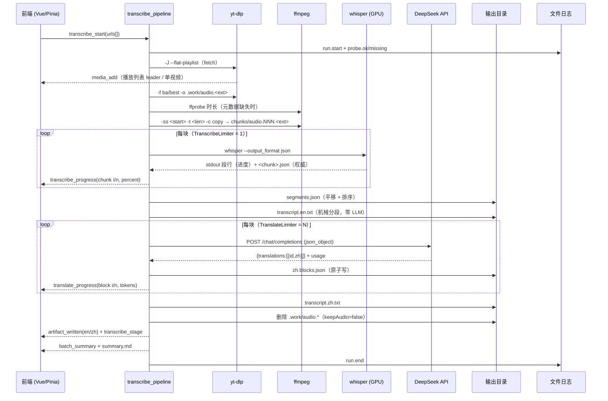

# 转录 + 翻译流程

## Purpose

描述一条视频从入队到两份 txt 的端到端流程、阶段状态机与跳过/续跑判定。

## Current Behavior

### 端到端

### 阶段与状态

| 阶段（`transcribe_stage`） | 前端 `MediaState` | 说明 |
| --- | --- | --- |
| `downloadingAudio` | `downloadingAudio` | fetch 之后、音频落盘之前 |
| `transcribing` | `transcribing` | 切块 + whisper + 合并 + 写原稿 |
| `translating` | `translating` | 逐 block 调用 DeepSeek 并落盘 |
| `writing` | `writing` | 组装中文稿、清理音频 |

终态：`done`（含「已存在跳过」标记）/ `error` / 取消（前端显示暂停态，见 `error-handling.md`）。
GPU 全程串行（`TranscribeLimiter = 1`）；翻译并发为 `translation.concurrency`；视频级并发复用下载信号量（默认 2）。

### 跳过与续跑

| 条件 | 行为 |
| --- | --- |
| `.work/source.json` 命中且两份 txt 存在，`overwrite=false` | 零网络跳过（不调用 yt-dlp/whisper/DeepSeek），`done` + 汇总 `skipped` |
| `segments.json` 完整 | 跳过 whisper，复用分段（仅当未重转录时才可复用译文） |
| `zh.blocks.json` 与当前 block 计划完全匹配 | 跳过翻译 |
| `overwrite=true` | 全部重跑，`.tmp` → rename 覆盖 |
| 失败/取消 | 保留音频与中间产物，便于续跑；不写半截 txt |

## Boundaries

- 播放列表不做选择 UI：全部条目自动展开；`PlaylistEntry.index` 不参与调度。
- 阶段事件只做展示驱动；块完成以 JSON 文件落盘为权威。

## Contracts

产物结构、固定文件名与 `.work` 生命周期见 `data-model.md`；事件字段见 `api-contract.md`。

## Failure And Edge Cases

- fetch 失败：`fetchFailed`，该条 `error`，不发 `media_add`。
- 无语音（0 段）：不写 txt，`done` + 汇总标记跳过。
- 取消：杀当前进程树，落盘前检查取消标志（不写中文稿）；在途 DeepSeek 请求允许完成。
- 队列中（尚未派发）取消的条目当前不会上报结果，批次可能不写 `summary.md`（开放项，见 change worklog W009）。

## Verification

`cargo test`（L1）+ `TRANSCRIBE_E2E=1 cargo test --test transcribe_e2e`（L2，规划中）+ L3 真机（见 `verification.md`）。
