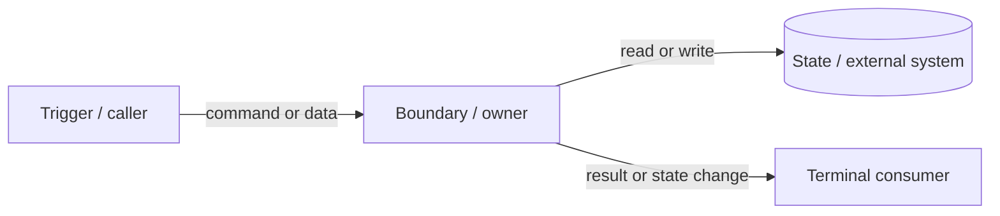

<!--
Lifecycle: this file starts `status: draft`. When the change lands, flip it to
`status: implemented` and add `landed_in: <last worklog loop / commit>`. If a
later change replaces this approach, set `status: superseded` + `superseded_by`.
A design left at `draft` forever makes it impossible to tell what actually shipped.

Versioning: all pre-implementation iterations (draft, design review, revisions)
count as v1.0 and never bump `version`. Only developer feedback AFTER delivery
and review triggers a version bump (v2.0, …); append a `Version History` entry
describing trigger, exact changes, impact scope, and handling status.
Implementation-time drift goes into `Design Deviations`, never into version history.
-->

---
status: draft
layer: change
domain: <domain>
created_at: <YYYY-MM-DD>
version: 1.0
updates_current:
  - docs/current/domains/<domain>/overview.md
---

# <Feature Or Change> Design

## Problem

## Goals

## Non-Goals

## Must-Not-Break Existing Behavior

<!--
List 2-5 existing behaviors, adjacent flows, or user-visible invariants that
must still hold after this change lands. This section exists to prevent the
agent from describing only the new behavior while silently regressing a nearby
stable path.
-->

- <existing behavior / invariant that must remain true>

## Current Behavior

## Proposed Behavior

## Alternatives Considered

<!--
Record the technical approaches that were weighed and rejected, with the reason.
Requirement/product discussion is out of scope for this file, but technical
tradeoffs (sync vs async, new service vs inline, table change vs reuse) belong
here so the "why not X" is not lost. If a tradeoff is long-lived and will
constrain future work, promote it to a decisions/ADR and link it here.
-->

| 方案 | 结论 | 理由 | 是否升级为 ADR |
|---|---|---|---|
| <approach A> | 采用 / 否决 |  | ADR-xxxx / n/a |

## Business Flow

## End-to-End Data Interaction Flow

<!--
Required when the change crosses frontend/backend, API/service, persistence,
cache/queue/third-party, or multiple backend class/component boundaries.

Provide one Mermaid flowchart or sequence diagram that follows the main data or
command path from trigger to terminal consumer. Show responsibility handoffs,
state reads/writes, and only the critical transaction, failure, async,
idempotency, authorization/ownership, or consistency boundaries. Backend-only
changes are included when data crosses classes. Keep this at architectural
constraint level; do not turn it into method-by-method pseudocode.
-->

| 关键节点 | 输入 | 节点职责 | 输出 / 状态变化 | 关键边界 |
|---|---|---|---|---|
| <page / controller / service / class / repository / external system> | <command or data> | <single owned responsibility> | <result, event, or persisted state> | <transaction / failure / async / idempotency / auth / consistency> |

## Data And API Impact

## Frontend Fetching Logic

## Frontend Behavior

## Backend Fetching Logic

## Backend Behavior

## Error Handling

## Risks

## Verification

## Design Deviations

<!--
Append here whenever implementation diverges from this design (a loop discovers
the design was wrong, incomplete, or impractical). Keep the design honest instead
of silently drifting. Each row: what changed vs plan, which loop found it, and
whether this design body or a current doc must be amended.
-->

| 偏差 | 发现于 | 与设计不符之处 | 处理（改设计 / 改现状文档 / 接受） |
|---|---|---|---|
| <deviation> | Lxxx |  |  |

## Version History

<!--
Version semantics: pre-implementation iterations count as v1.0 only. A version
bump (v2.0, …) is triggered ONLY by developer feedback after delivery and
review. Implementation-time drift stays in Design Deviations and never bumps
the version. After a bump, re-run the Design Review when goals/scope/API
changed; append records, never overwrite v1.0 content.
-->

### v2.0 — <YYYY-MM-DD>

- 触发：<开发者验收反馈，问题描述>
- 改动内容：<逐条列出>
- 影响范围：<受影响的 Goals / Non-Goals / 接口 / 流程章节>
- 处理状态：<已重新实施 / 待实施 / 已拒绝并说明理由>

## Current Doc Updates

- [ ] `docs/current/domains/<domain>/index.md`
- [ ] `docs/current/domains/<domain>/overview.md`
- [ ] `docs/current/domains/<domain>/flow.md`
- [ ] `docs/current/domains/<domain>/api-contract.md`
- [ ] `docs/current/domains/<domain>/frontend-behavior.md`
- [ ] `docs/current/domains/<domain>/backend-behavior.md`
- [ ] `docs/current/domains/<domain>/verification.md`
- [ ] `docs/manifest.yaml`
